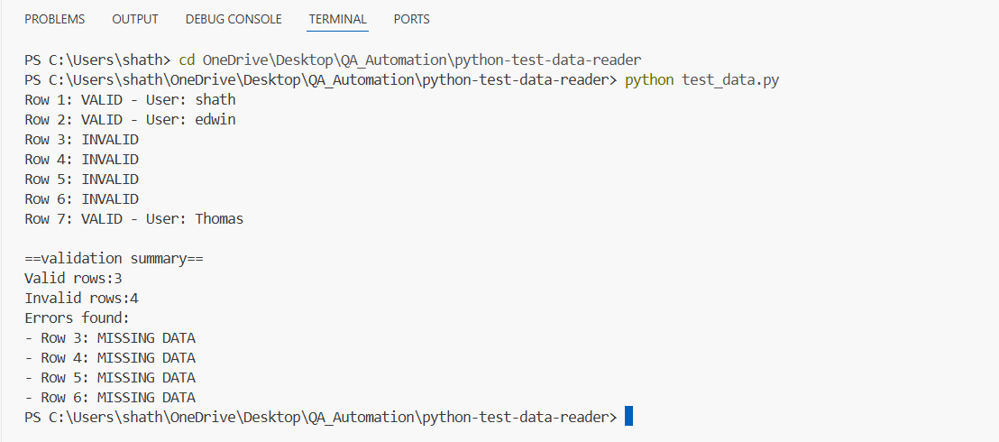

# Python Test Data Reader

## Project Overview

A data-driven Python script that reads test login credentials from a CSV file,
validates that all required fields (username, password, expected) are present,
and generates a structured validation summary report.

This project demonstrates data-driven testing principles — separating test data
from test logic so that non-technical team members can update test data without
modifying the code.

## Tools Used
- Python 3.14
- csv module (built into Python — no install needed)
- VS Code (code editor)

## Test Scenarios Covered
- Reads all rows from a CSV test data file
- Validates that each row has a non-empty username field
- Validates that each row has a non-empty password field
- Validates that each row has a non-empty expected field
- Reports how many rows passed and failed validation
- Lists specific rows that are missing data

## How to Run
### Prerequisites
- Python 3.14 installed (https://www.python.org/downloads/)
- VS Code installed (https://code.visualstudio.com/)

### Steps
1. Clone or download this repository
2. Open a terminal in the project folder
3. Make sure test_data.csv is in the same folder as test_data_reader.py
4. Run the script:
python test_data_reader.py

### Expected Output
Row 1: VALID - User: shath
Row 2: VALID - User: edwin
Row 3: INVALID
Row 4: INVALID
Row 5: INVALID
Row 6: INVALID
Row 7: VALID - User: Thomas

==validation summary==
Valid rows:3
Invalid rows:4
Errors found:
- Row 3: MISSING DATA
- Row 4: MISSING DATA
- Row 5: MISSING DATA
- Row 6: MISSING DATA

##output

##Author
Shathvika K

